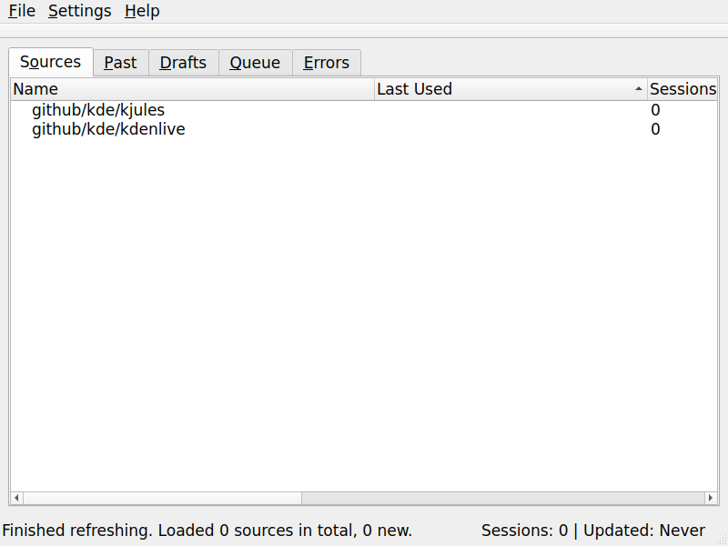
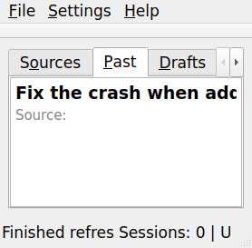
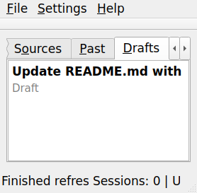
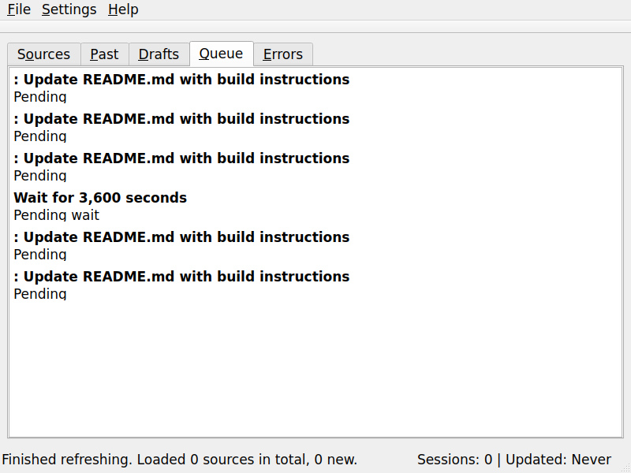
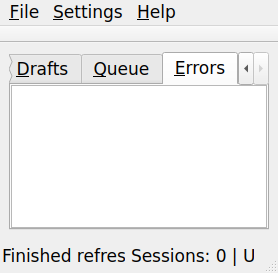
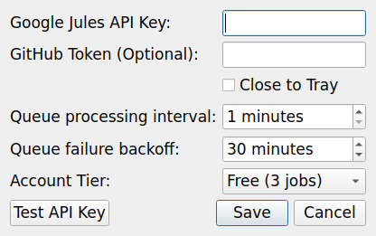
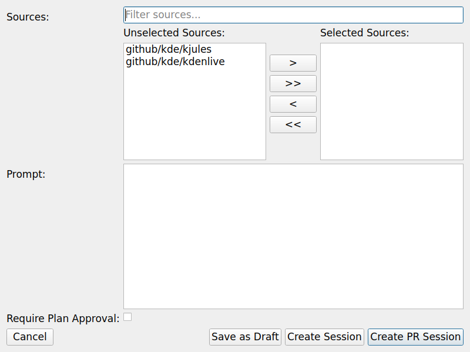
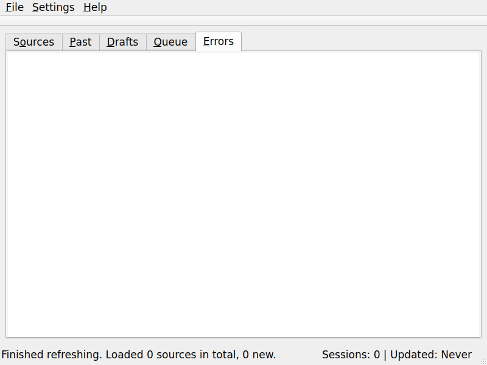
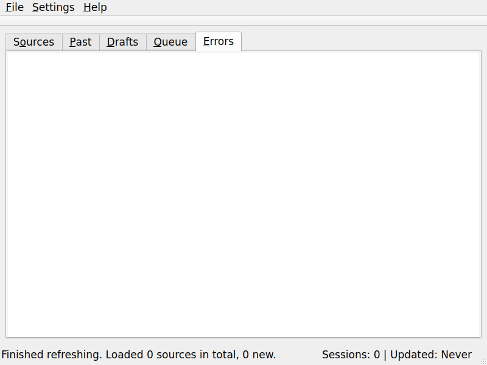
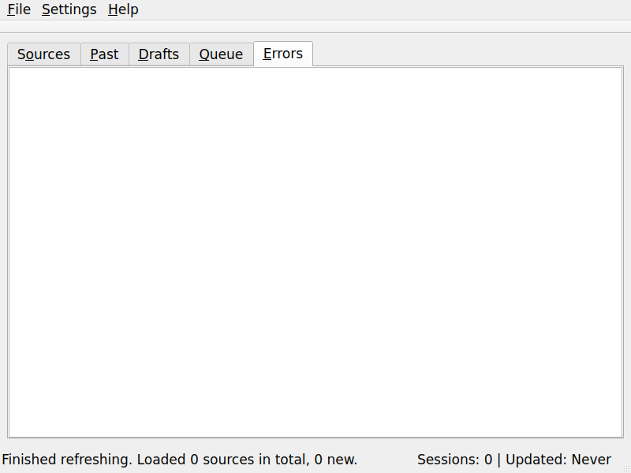

# Kgithub-notify

A GitHub KDE task program written in C++ that notifies you when there is a new GitHub notification.

When you click on the notification, it presents you with its own version of:
*   [GitHub Notifications](https://github.com/notifications)
*   [GitHub Pull Requests](https://github.com/pulls)
*   The GitHub feed/wall
*   Explore

## Features & Screenshots

The application provides a tabbed interface for managing your sources and sessions:

### Sources
View your available sources (e.g., GitHub repositories).


### Past Sessions
Review past sessions you have created.


### Drafts
Create and save draft sessions to send later.


### Queue
Manage your queue of sessions to be processed.


### Errors
Review and retry sessions that have encountered errors.


### Settings Dialog
Configure your API keys and application preferences.


### New Session Dialog
Create a new session with your selected sources.


### Application Menus
Access additional features via the main menu bar.




## Build Instructions

### Prerequisites

*   C++ Compiler (C++17 support required)
*   CMake (version 3.10 or higher)

### Building

1.  Clone the repository:
    ```bash
    git clone https://github.com/yourusername/Kgithub-notify.git
    cd Kgithub-notify
    ```

2.  Create a build directory:
    ```bash
    mkdir build
    cd build
    ```

3.  Configure and build the project:
    ```bash
    cmake ..
    cmake --build .
    ```

4.  Run the application:
    ```bash
    ./Kgithub-notify
    ```

## License

This project is licensed under the BSD 3-Clause License - see the [LICENSE](LICENSE) file for details.
