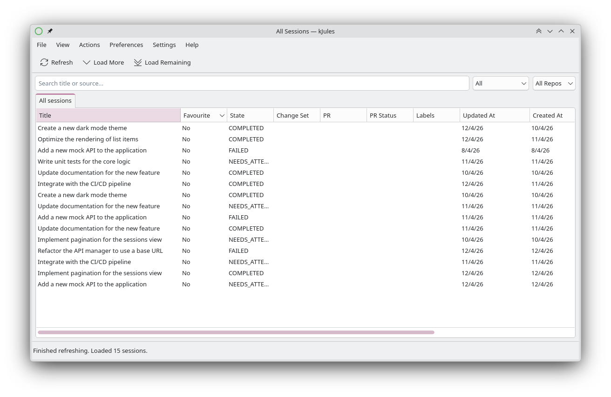
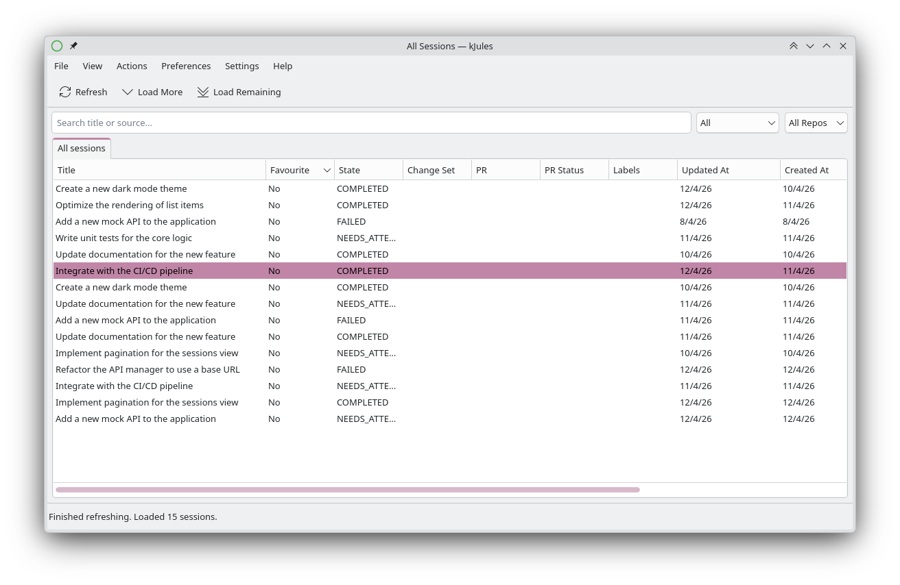
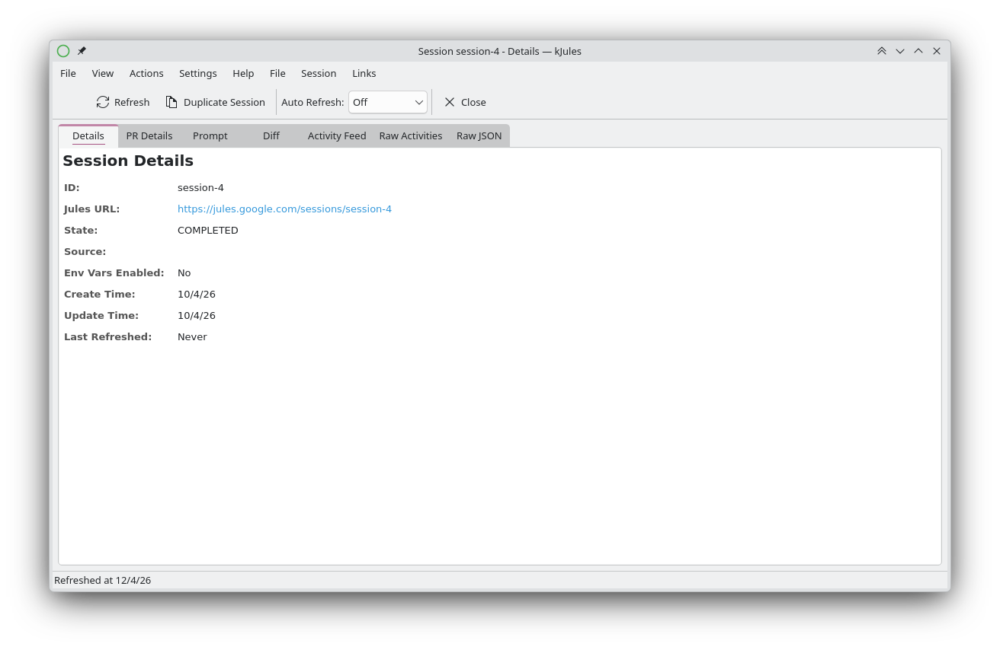
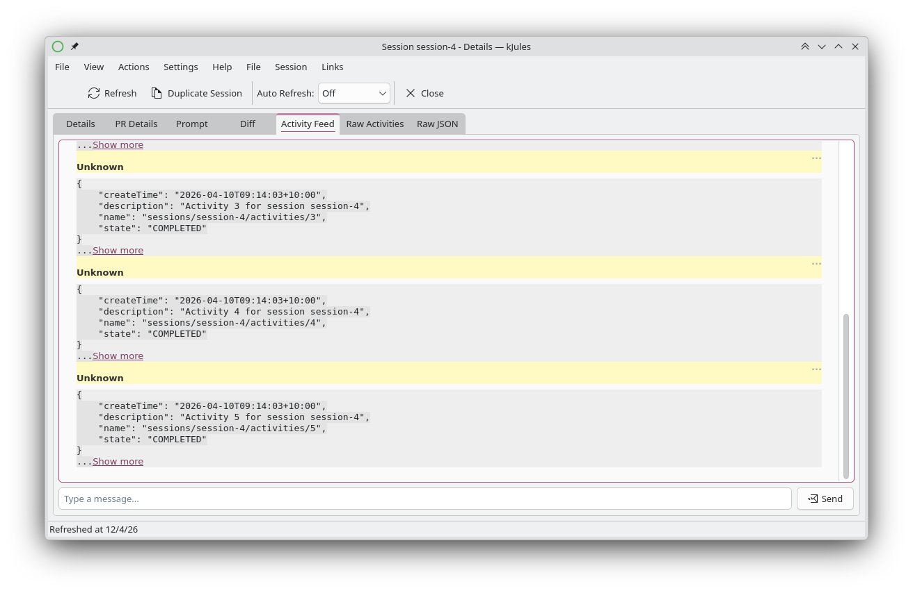
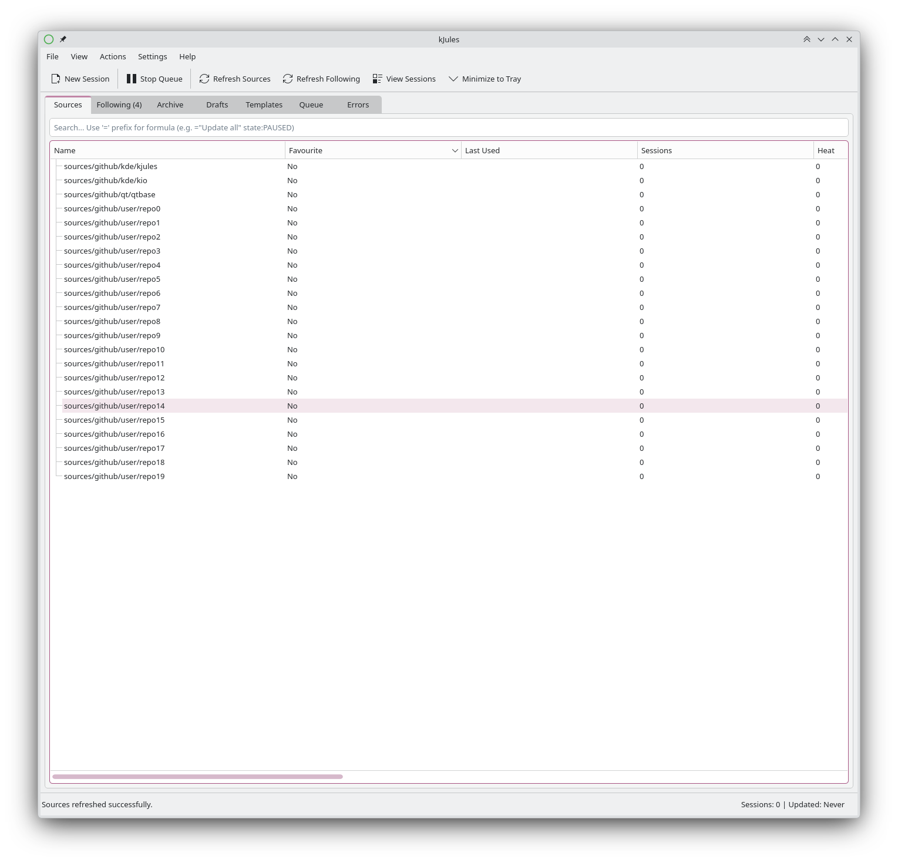
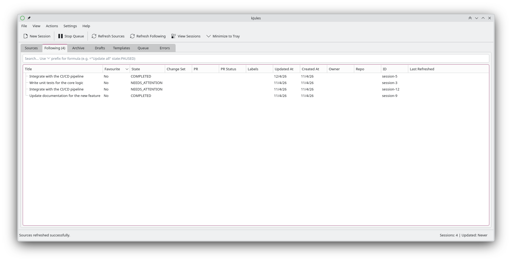
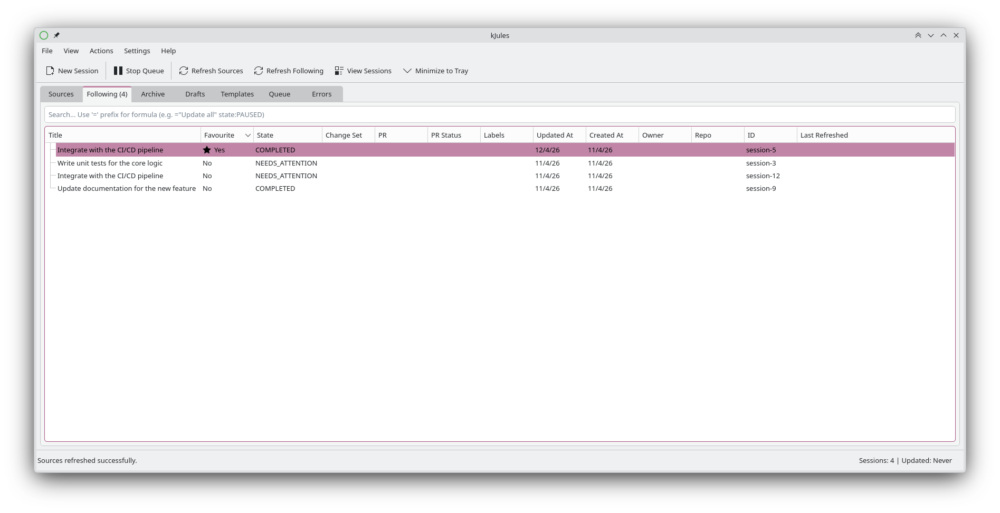
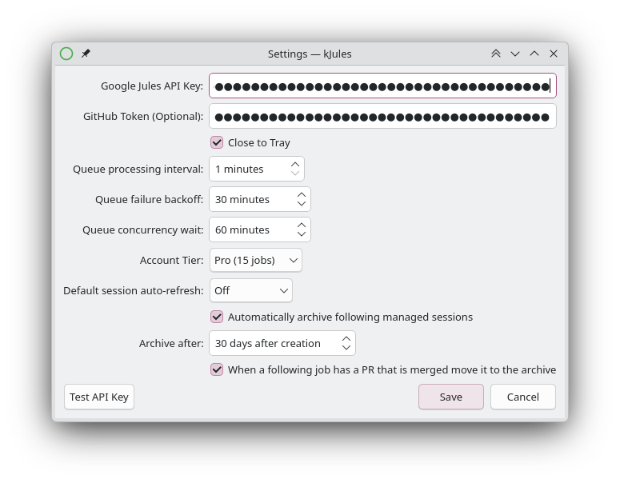
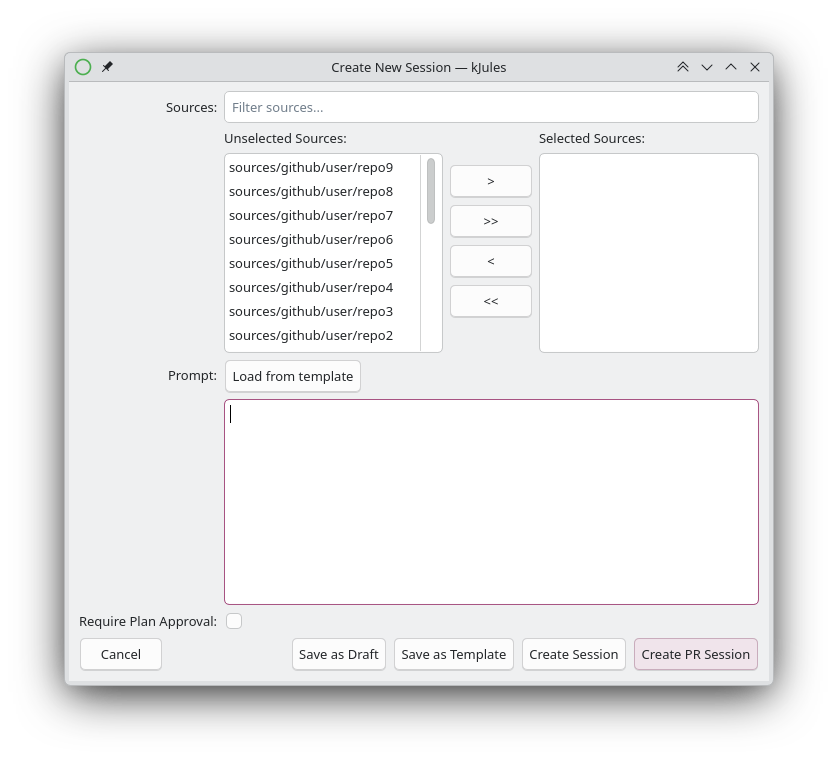

# kjules

A powerful KDE6/Qt6 native desktop client written in C++ for tracking and managing GitHub tasks, PRs, and background processing sessions. Originally known as Kgithub-notify, **kjules** gives you a fast, native desktop experience for interacting with your GitHub workflow.

When you click on a notification or open the application, it presents you with a comprehensive desktop-native version of:
*   [GitHub Notifications](https://github.com/notifications)
*   [GitHub Pull Requests](https://github.com/pulls)
*   The GitHub Feed and Activity Wall
*   Explore

## Features

- **Robust Session Management:** Manage tasks across an explicit state-based workflow including Drafts (unsubmitted), Queue (processing), Errors (failed, pending retry), Following (active managed sessions), and Archive (history).
- **Detailed Session Views:** Dive deep into session details, view PR statuses and labels, track diffs, and read the JSON activity feed.
- **Advanced Filtering:** Powerful built-in filtering using a drag-and-drop AST (Abstract Syntax Tree) visual filter editor.
- **System Tray Integration:** Runs efficiently in the background, utilizing KDE's `KNotification` to deliver non-intrusive alerts for queue errors and completion events.
- **Mock API Support:** Includes an interactive Go-based mock API server for local testing and realistic state simulation without consuming real GitHub API quotas.

## Screenshots

### All Sessions


### Session Selection


### Session Details


### Activity Feed


### Additional Views
<details>
  <summary>Click to view more screenshots</summary>

  
  
  
  
  
</details>

## Build Instructions

### Prerequisites

*   C++ Compiler (C++17 support required)
*   CMake (version 3.16 or higher)
*   Qt 6 & KDE Frameworks 6 libraries

On Ubuntu/Debian, install the required dependencies:
```bash
sudo apt-get update && sudo apt-get install -y extra-cmake-modules libkf6xmlgui-dev libkf6config-dev libkf6i18n-dev libkf6coreaddons-dev qt6-base-dev libkf6crash-dev libkf6notifications-dev libkf6kio-dev libkf6dbusaddons-dev libkf6itemmodels-dev qt6-tools-dev libkf6wallet-dev libkf6archive-dev libkf6globalaccel-dev qt6-declarative-dev
```

### Building

1.  Clone the repository:
    ```bash
    git clone https://github.com/yourusername/kjules.git
    cd kjules
    ```

2.  Create a build directory:
    ```bash
    mkdir build
    cd build
    ```

3.  Configure and build the project:
    ```bash
    cmake ..
    cmake --build .
    ```

4.  Run the application:
    ```bash
    ./kjules
    ```

## License

This project is licensed under the BSD 3-Clause License - see the [LICENSE](LICENSE) file for details.
